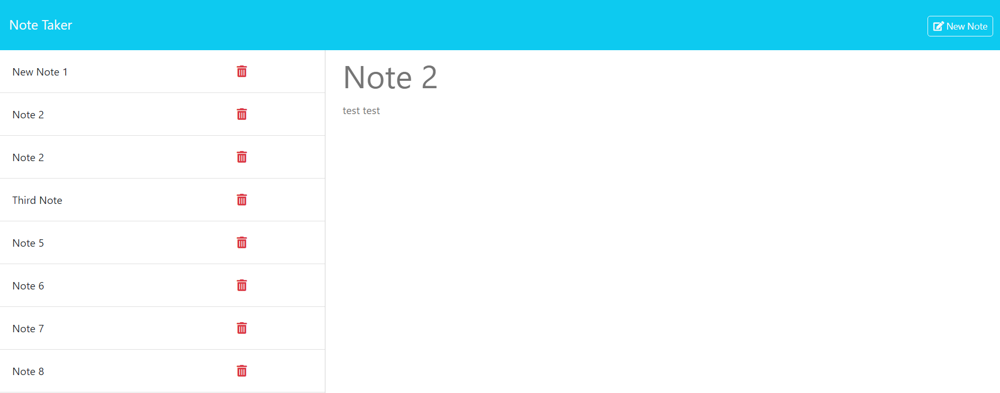

# Note Taker

## Description
    
This application keeps track of personal notifications. It allosws the user to add a note which contains a note title and note text. Upon creating the note, an Id is appended to the note. These notes are stored in a db.json file meant to simulate a back end server. It uses API's to get, post and delete data from this DB. This application uses express middleware, along with several basic helper functions to complete all of these functions
    
## Table of Contents (Optional)
    
- [Installation](#installation)
- [Usage](#usage)
- [Credits](#credits)
- [Questions](#questions)

    
## Installation
    
This application requires NodeJs in order to run. From there Node Package Manager is used to manage any dependencies. For this project I used Express as stated above as middleware, and NodeMon to simplify updating, and restarting the NodeJs server in real time
    
## Usage
    
The application qis hosted online on Heroku, so it can be accessed via URL. It is used to store and keep track of any notes the user may want to write down
    

        
    
## Credits
    
This project was completed solely by myself

## Questions

If you have any questions, feel free to reach out to me at nate.mcmahon47@gmail.com or reference my GitHub:
[github.com/natemcmahon](github.com/natemcmahon)